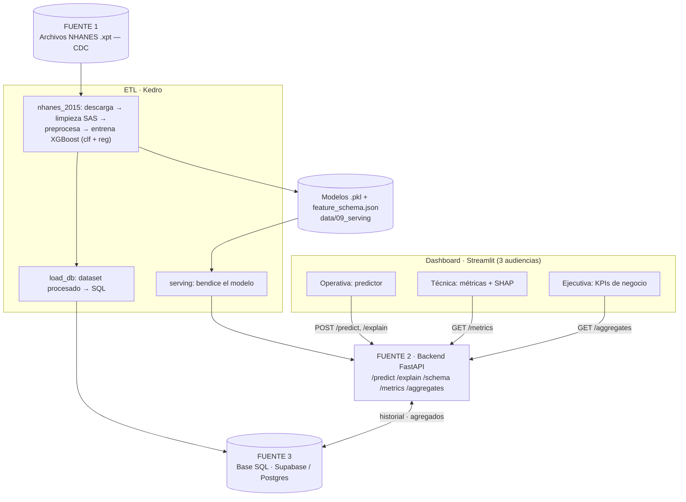
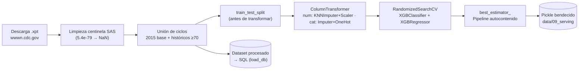
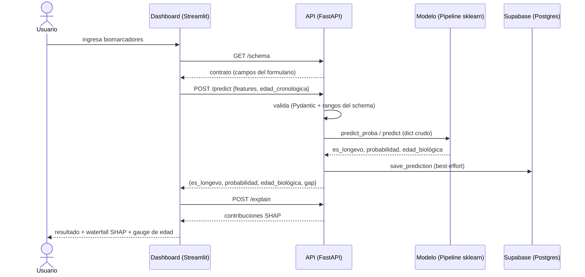
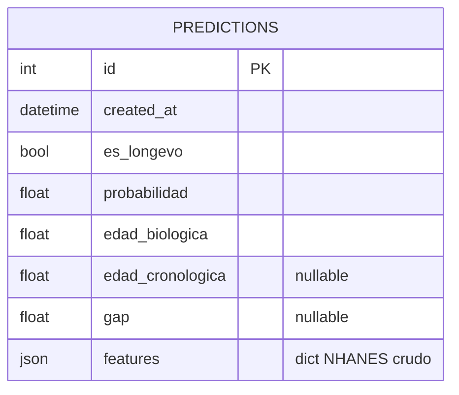

# Arquitectura

## Visión general
El sistema cubre el ciclo completo de un proyecto de datos: **ingesta → ETL →
entrenamiento → serving → API → dashboard**, con persistencia SQL y empaquetado
en Docker. Se construye como **monorepo** para que el ETL (Kedro), el backend
(`api/`) y el dashboard (`dashboards/`) compartan un único contrato
(`feature_schema.json`) y los modelos bendecidos (`data/09_serving/`).

## Las 3 fuentes de datos
La solución integra tres fuentes **de distinta naturaleza** (requisito del encargo):

| # | Fuente | Tipo | Rol en el sistema |
|---|--------|------|-------------------|
| 1 | Archivos NHANES `.xpt` (SAS) descargados de la CDC | Archivos remotos | Materia prima del ETL/entrenamiento |
| 2 | API REST propia (FastAPI) | Servicio REST | El dashboard consume predicciones y explicabilidad |
| 3 | Base SQL (Supabase / Postgres) | Base de datos | Historial de predicciones + agregados para la vista ejecutiva |

## Diagrama 1 — Componentes (end-to-end)

## Diagrama 2 — Flujo del ETL y entrenamiento
Clave: el `train_test_split` ocurre **antes** de cualquier transformación, y el
preprocesamiento vive dentro del `Pipeline` (se ajusta solo con train en cada
fold) → **sin fuga de datos**. El `best_estimator_` resultante es autocontenido.

## Diagrama 3 — Secuencia de una predicción

## Diagrama 4 — Modelo de datos (historial)

## Componentes
| Componente | Ubicación | Responsabilidad |
|---|---|---|
| Pipelines de ciclo | `src/ev3_nhanes/pipelines/nhanes_*` | Descarga, limpieza, preprocesamiento y entrenamiento por ciclo NHANES |
| Pipeline `serving` | `src/ev3_nhanes/pipelines/serving` | Copia el modelo 2015 a una ruta estable + `metadata.json` |
| Pipeline `load_db` | `src/ev3_nhanes/pipelines/load_db` | Carga el dataset procesado a la base SQL |
| Contrato | `feature_schema.json` | Fuente única de verdad de las 23 features (tipos, rangos, opciones) |
| `model_registry.py` | `api/` | Carga modelos, `predict`, `explain` (SHAP) |
| `db.py` | `api/` | `save_prediction` (best-effort) y `get_aggregates` (SQLAlchemy) |
| `schema.py` | `api/` | Modelos Pydantic + validación contra el contrato |
| `main.py` | `api/` | App FastAPI y endpoints REST |
| Dashboard | `dashboards/` | Streamlit con vistas ejecutiva / técnica / operativa |

## Decisiones de diseño
1. **Pickles autocontenidos.** El preprocesamiento (imputación, escalado, one-hot)
   vive dentro del `Pipeline` sklearn. La API no reimplementa nada: arma un
   DataFrame crudo de 1 fila y delega en `.predict()`. Reduce el riesgo de
   *training/serving skew*.
2. **Sin fuga de datos.** `train_test_split` antes de transformar; el
   `ColumnTransformer` se ajusta dentro de cada fold de `RandomizedSearchCV`.
3. **Campos opcionales → null → imputado.** El imputador fiteado completa los
   campos no clínicos ausentes; el formulario solo exige ~11 clínicos.
4. **`RIDAGEYR` no es input del modelo.** Es el target de regresión; la edad
   cronológica se pide solo para mostrar el *gap* `edad_biológica − edad_cronológica`.
5. **Persistencia best-effort.** Si la base SQL no está disponible, `/predict`
   igual responde; solo se pierde el registro en el historial.
6. **Configuración por entorno.** Rutas y `DATABASE_URL` se leen de variables de
   entorno; SQLite es el fallback local y Postgres/Supabase el destino productivo.

## Stack
- **ETL/ML:** Kedro 1.4, pandas, scikit-learn, XGBoost, SHAP
- **Backend:** FastAPI, Pydantic, SQLAlchemy 2.0, uvicorn
- **Frontend:** Streamlit
- **Datos:** Supabase (Postgres) · SQLite (dev)
- **Infra:** Docker, docker-compose · gestión de dependencias con `uv`
