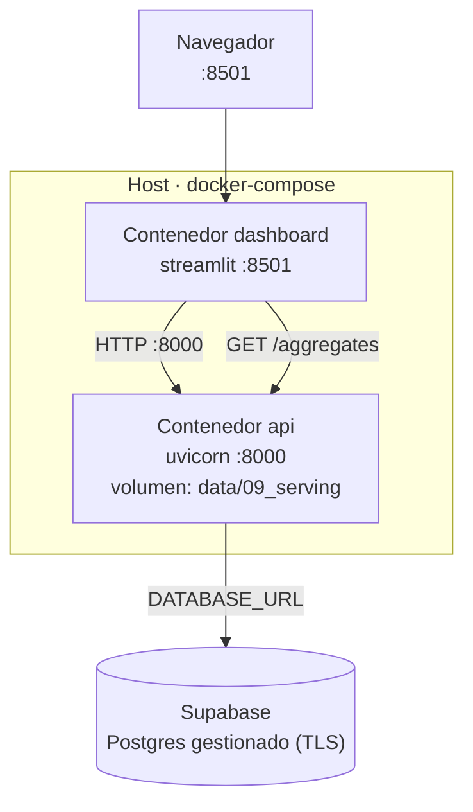

# Guía de despliegue

Tres modos: **desarrollo local**, **Docker** (un servicio) y **docker-compose**
(api + dashboard, con Supabase como base externa).

## Diagrama de despliegue (objetivo)


## Requisitos
- Python 3.10+ y [`uv`](https://docs.astral.sh/uv/) (o `pip`)
- Docker + docker-compose (para los modos containerizados)
- Acceso a internet (el ETL descarga datos de la CDC)
- (Producción) un proyecto Supabase con su connection string

## 0. Preparar el entorno
```bash
uv sync                      # instala dependencias del proyecto
uv pip install -r api/requirements.txt   # deps del backend (incluye sqlalchemy, psycopg2)
```

## 1. Generar el modelo de producción (una vez)
```bash
kedro run --pipeline nhanes_2015   # descarga CDC + entrena (lento)
kedro run --pipeline serving       # bendice a data/09_serving/
```
Produce `model_clasificacion_2015.pkl`, `model_regresion_2015.pkl` y `metadata.json`.

## 2. Variables de entorno
| Variable | Default | Uso |
|---|---|---|
| `DATABASE_URL` | `sqlite:///data/predictions.db` | Conexión a la base SQL |
| `MODEL_DIR` | `data/09_serving` | Carpeta de modelos bendecidos |
| `FEATURE_SCHEMA_PATH` | `feature_schema.json` | Contrato de features |
| `EV3_ROOT` | raíz del repo | Raíz para resolver rutas relativas |

Para Supabase (Postgres gestionado):
```bash
# usar el connection pooler (puerto 6543, modo transaction) para una API
export DATABASE_URL="postgresql://postgres:[PASSWORD]@[HOST]:6543/postgres?sslmode=require"
```
> El driver `psycopg2-binary` ya está en `api/requirements.txt`; SQLAlchemy
> interpreta `postgresql://` con psycopg2 por defecto.

## 3. Desarrollo local
```bash
# Backend
uvicorn api.main:app --reload          # http://localhost:8000/docs
# Dashboard (en otra terminal)
streamlit run dashboards/app.py        # http://localhost:8501
```
Sin `DATABASE_URL`, el backend usa SQLite local automáticamente (las tablas se
crean al arrancar).

## 4. Docker (solo backend)
```bash
docker build -f api/Dockerfile -t ev3-api .
docker run -p 8000:8000 \
  -v "$PWD/data:/app/data" \
  -e DATABASE_URL="$DATABASE_URL" \
  ev3-api
```
Los modelos bendecidos se montan como volumen (`-v`); la base es externa (Supabase).

## 5. docker-compose (api + dashboard)
```bash
# crea un archivo .env con DATABASE_URL (no se versiona)
echo 'DATABASE_URL=postgresql://...:6543/postgres?sslmode=require' > .env
docker-compose up --build
# api :8000 · dashboard :8501
```
Como la base es Supabase (gestionada), **no hay contenedor Postgres**: ambos
servicios reciben `DATABASE_URL` por entorno desde el `.env`.

## Verificación
```bash
curl http://localhost:8000/health
# {"status":"ok","models_ready":true,"db_ready":true}
```

## Troubleshooting
| Síntoma | Causa | Solución |
|---|---|---|
| `/health` con `models_ready:false` | Falta bendecir el modelo | `kedro run --pipeline serving` |
| `/health` con `db_ready:false` | `DATABASE_URL` incorrecta o BD caída | Revisar credenciales / `sslmode=require` |
| `predict` responde pero no persiste | BD caída (escritura best-effort) | Ver logs `ev3.api.db`; verificar conexión |
| Error SSL contra Supabase | Falta TLS | Agregar `?sslmode=require` a la URL |
| Conexiones agotadas en Supabase | Se usó la conexión directa (5432) | Usar el pooler (6543, transaction) |
