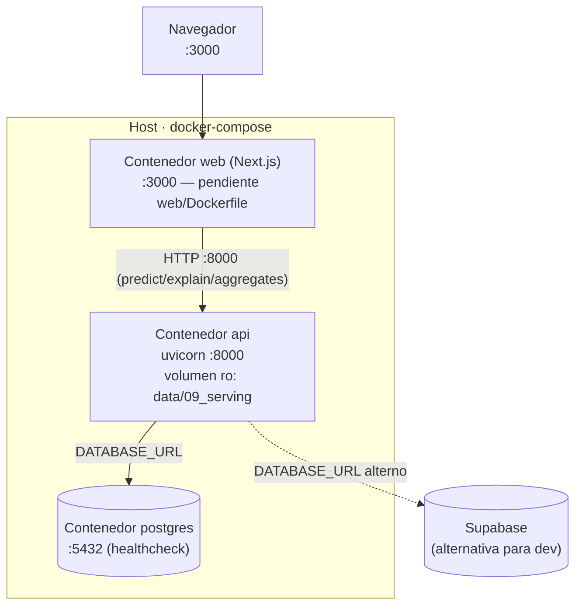

# Guía de despliegue

Tres modos: **desarrollo local**, **Docker** (un servicio) y **docker-compose**
(stack self-contained con Postgres local). La app es **DB-agnostic** (`DATABASE_URL`):
el compose usa Postgres local; en dev se puede apuntar a Supabase o SQLite.

## Diagrama de despliegue (docker-compose)


## Requisitos
- Python 3.10+ y [`uv`](https://docs.astral.sh/uv/)
- Node 20+ (para el frontend Next.js)
- Docker + docker-compose (para los modos containerizados)
- Acceso a internet (el ETL descarga datos de la CDC)

## 0. Entrenar el modelo (una vez, requerido)
```bash
make train          # = kedro run --pipeline nhanes_combined + serving
```
Descarga la CDC (todos los ciclos del equipo), entrena el modelo combinado
(XGBoost + RandomizedSearchCV) y bendice a `data/09_serving/`
(`model_clasificacion_2015.pkl`, `model_regresion_2015.pkl`, `metadata.json` —
los nombres conservan el sufijo `_2015` por compatibilidad, el contenido es el
combinado). Ver métricas en [modelo.md](modelo.md).

> ⚠️ **Los modelos viven en `data/`, que está en `.gitignore`** — no se commitean.
> Cada entorno (cada dev, el Docker) debe correr `make train` una vez. El compose
> monta `./data` como volumen de solo-lectura, así que el host **debe** tener los
> modelos antes de `make up`.

## 1. Variables de entorno (`.env`, copiar de `.env.example`)
| Variable | Default | Uso |
|---|---|---|
| `DATABASE_URL` | `sqlite:///data/predictions.db` | Conexión SQL (dev: Supabase o SQLite) |
| `POSTGRES_USER` / `POSTGRES_PASSWORD` / `POSTGRES_DB` | `nhanes` / `nhanes_pass` / `nhanes_db` | Credenciales del Postgres del compose |
| `CORS_ORIGINS` | `http://localhost:3000,...` | Orígenes permitidos (coma-separados) |
| `MODEL_DIR` | `data/09_serving` | Carpeta de modelos bendecidos |

Para dev contra **Supabase** (pooler, TLS):
```bash
export DATABASE_URL="postgresql://postgres.[REF]:[PASSWORD]@[HOST]:6543/postgres?sslmode=require"
```

## 2. Desarrollo local (sin Docker)
```bash
uv sync                                  # deps Python
uv pip install -r api/requirements.txt   # deps backend (sqlalchemy, psycopg2, ...)
make serve                               # uvicorn -> http://localhost:8000/docs
# Frontend (otra terminal):
cd web && npm install && npm run dev     # http://localhost:3000
```
Sin `DATABASE_URL`, el backend usa SQLite local (las tablas se crean al arrancar).

## 3. Docker (solo backend)
```bash
make build                               # docker build -f api/Dockerfile -t ev3-api .
docker run -p 8000:8000 -v "$PWD/data:/app/data" -e DATABASE_URL="$DATABASE_URL" ev3-api
```

## 4. docker-compose (stack completo)
```bash
cp .env.example .env     # ajustar POSTGRES_* si se quiere
make up                  # docker compose up --build -d  (postgres + api)
make logs                # seguir logs
make down                # bajar
```
- **postgres** (`:5432`) + **api** (`:8000`) con healthchecks y `depends_on`.
- El servicio **web** (Next.js, `:3000`) está listo en `docker-compose.yml` pero
  comentado: se activa cuando exista `web/Dockerfile` (pendiente de Nicolás).

## 5. Despliegue en EC2 (producción)

Esquema típico: una instancia EC2 sirve el **frontend** (Next.js `:3000` o detrás
de Nginx `:80`) y el **backend** (uvicorn `:8000`), con la BD en Supabase.

**a) Backend — escuchar en todas las interfaces (no `127.0.0.1`):**
```bash
export DATABASE_URL="postgresql://...supabase.../postgres?sslmode=require"
export CORS_ORIGINS="http://<IP_o_dominio_del_front>"   # ¡el origen del FRONT!
uvicorn api.main:app --host 0.0.0.0 --port 8000
```
Si lo arrancas con `--reload` (sin `--host`), uvicorn escucha solo en loopback y
las peticiones de afuera **se cuelgan** hasta el timeout del front (8 s). Con Docker
ya viene bien (`api/Dockerfile` usa `--host 0.0.0.0`).

**b) Frontend — hornear la URL pública del backend y reconstruir:**
```bash
# web/.env.local (o build-arg del Dockerfile)
NEXT_PUBLIC_API_URL=http://<IP_o_dominio_del_back>:8000
cd web && npm run build && npm run start    # NEXT_PUBLIC_* se fija en build, no runtime
```

**c) Security Group (Inbound rules):** abrir los puertos que se exponen:
| Puerto | Para |
|---|---|
| 22 | SSH |
| 80 / 443 | Frontend (HTTP/HTTPS) |
| 3000 | Frontend si se sirve directo con `npm start` |
| 8000 | Backend (uvicorn) — **si falta, las llamadas del front se cuelgan** |

**d) IP pública estable.** La IP pública de EC2 **cambia al detener/arrancar** la
instancia. Como `NEXT_PUBLIC_API_URL` queda horneada en el build, tras un reinicio
el front apuntaría a una IP muerta. Asigna una **Elastic IP** o usa un **dominio**
(ver sección siguiente).

### Dominio propio (`tuedad.me`)
Con un dominio evitas el problema de la IP y puedes poner HTTPS. Pasos:

1. **Elastic IP:** en EC2 → *Elastic IPs* → *Allocate* → *Associate* a la instancia.
   Esa IP ya no cambia entre reinicios.
2. **DNS** (en el panel donde administras `tuedad.me`): crear registros **A** → la Elastic IP:
   - `tuedad.me` y `www` → frontend.
   - `api.tuedad.me` → backend (mismo servidor, distinto puerto/Nginx).
3. **Reverse proxy (Nginx)** en la instancia para servir todo por `:443` con un solo
   certificado (recomendado): `tuedad.me` → front `:3000`, `api.tuedad.me` → back `:8000`.
   Ver [Nginx + HTTPS](#nginx--https-recomendado) abajo.
4. Re-hornear el front con el dominio y actualizar CORS (al final, ya con HTTPS):
   ```bash
   # web/.env.local
   NEXT_PUBLIC_API_URL=https://api.tuedad.me
   # backend
   export CORS_ORIGINS="https://tuedad.me,https://www.tuedad.me"
   ```

> ⚠️ **No mezclar HTTP y HTTPS.** Si el front se sirve por `https://` y el backend
> por `http://`, el navegador bloquea las llamadas (*mixed content*). O ambos HTTPS
> (con dominio + Certbot) o ambos HTTP.

### Nginx + HTTPS (recomendado)
Con Nginx delante, la app se sirve en `https://tuedad.me` y `https://api.tuedad.me`
(sin puertos en la URL, con candado). El archivo listo está en
[`deploy/nginx/tuedad.me.conf`](../deploy/nginx/tuedad.me.conf).

**Requisitos previos:** DNS apuntando a la Elastic IP (ya hecho), Security Group con
**80 y 443 abiertos** (los puertos 3000/8000 pueden quedar **cerrados** al exterior —
Nginx los alcanza por `localhost`), y el front+back corriendo en `localhost:3000` y
`localhost:8000`.

```bash
# 1. Instalar Nginx y copiar la config
sudo apt update && sudo apt install -y nginx
sudo cp deploy/nginx/tuedad.me.conf /etc/nginx/sites-available/tuedad.me
sudo ln -s /etc/nginx/sites-available/tuedad.me /etc/nginx/sites-enabled/
sudo rm -f /etc/nginx/sites-enabled/default
sudo nginx -t && sudo systemctl reload nginx
# A esta altura http://tuedad.me y http://api.tuedad.me ya funcionan (sin :puerto)

# 2. HTTPS gratis con Certbot (añade los bloques :443 y el redirect 80->443 solo)
sudo apt install -y certbot python3-certbot-nginx
sudo certbot --nginx -d tuedad.me -d www.tuedad.me -d api.tuedad.me
# Certbot renueva solo (timer systemd). Probar la renovación: sudo certbot renew --dry-run

# 3. Re-hornear el front a HTTPS y ajustar CORS (paso 4 de arriba), y reiniciar back+front
```

> **Si `nginx -t` falla con `sites-enabled/tuedad.me ... No such file or directory`:**
> el symlink quedó colgando porque el `cp` no copió el archivo (el repo del servidor
> no tenía `deploy/nginx/tuedad.me.conf`). Recrea el archivo en
> `/etc/nginx/sites-available/tuedad.me`, rehaz el symlink (`sudo rm -f` + `ln -s`) y
> vuelve a `nginx -t`.

### Servicios systemd (arranque automático)
Para que back y front sobrevivan a reinicios y cierres de terminal, en vez de
correr `uvicorn`/`npm` a mano usa los units de [`deploy/systemd/`](../deploy/systemd/):

```bash
# Secretos del backend fuera del repo:
sudo mkdir -p /etc/ev3
sudo nano /etc/ev3/api.env        # DATABASE_URL, CORS_ORIGINS, SECRET_KEY, SMTP_*
sudo chmod 600 /etc/ev3/api.env

# Instalar ambos servicios:
sudo cp deploy/systemd/ev3-api.service deploy/systemd/ev3-web.service /etc/systemd/system/
sudo systemctl daemon-reload
sudo systemctl enable --now ev3-api ev3-web
sudo systemctl status ev3-api ev3-web
journalctl -u ev3-api -f          # logs en vivo
```
Ajusta en los `.service` las rutas (`WorkingDirectory`, ruta de `uvicorn`/`npm`) si
el repo o el venv no están en `/home/ubuntu/ev3_nanhes`. El front debe estar
**construido** (`npm run build`) antes de arrancar `ev3-web`.

## Verificación
```bash
curl http://localhost:8000/health
# {"status":"ok","models_ready":true,"db_ready":true}

# Desde FUERA del servidor (tu máquina), comprobar que el backend es alcanzable:
curl -i http://<IP_o_dominio_del_back>:8000/schema
```

## Troubleshooting
| Síntoma | Causa | Solución |
|---|---|---|
| `/health` con `models_ready:false` | No se entrenó/bendijo | `make train` |
| `/health` con `db_ready:false` | `DATABASE_URL` incorrecta o BD caída | Revisar credenciales / contenedor `postgres` |
| `predict` responde pero no persiste | BD caída (escritura best-effort) | Ver logs `ev3.api.db` |
| Error SSL contra Supabase | Falta TLS | Agregar `?sslmode=require` a la URL |
| Conexiones agotadas en Supabase | Se usó la conexión directa (5432) | Usar el pooler (6543, transaction) |
| `docker compose` falla al montar modelos | Falta `make train` en el host | Entrenar antes de `make up` |
| Front carga pero llamadas en **(cancelado)** a los ~8 s | El backend no responde: puerto 8000 cerrado en el Security Group, o uvicorn en `127.0.0.1` | Abrir 8000 en Inbound rules y arrancar con `--host 0.0.0.0`. Probar `curl http://<IP>:8000/schema` desde fuera |
| Llamadas fallan al instante con error **CORS** en consola | `CORS_ORIGINS` no incluye el origen público del front | Exportar `CORS_ORIGINS="http://<IP_o_dominio_del_front>"` y reiniciar el backend |
| Funcionaba y dejó de funcionar tras reiniciar EC2 | La IP pública cambió; el build del front apunta a la IP vieja | Asignar **Elastic IP** o usar dominio, y re-hornear el front |
| Front en HTTPS, llamadas bloqueadas (*mixed content*) | Backend en HTTP desde una página HTTPS | Servir el backend por HTTPS (dominio + Certbot) |
