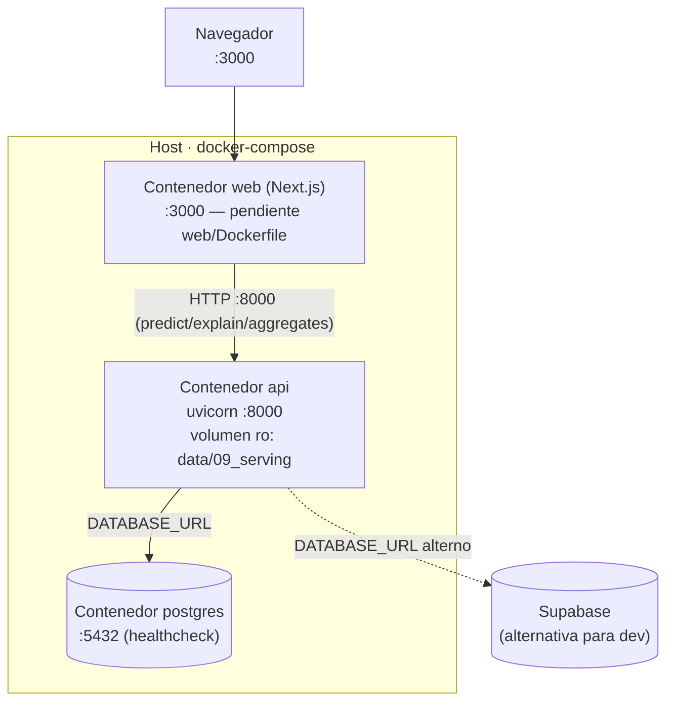

# Guía de despliegue

Tres modos: **desarrollo local**, **Docker** (un servicio) y **docker-compose**
(stack self-contained con Postgres local). La app es **DB-agnostic** (`DATABASE_URL`):
el compose usa Postgres local; en dev se puede apuntar a Supabase o SQLite.

## Diagrama de despliegue (docker-compose)


## Requisitos
- Python 3.10+ y [`uv`](https://docs.astral.sh/uv/)
- Node 20+ (para el frontend Next.js)
- Docker + docker-compose (para los modos containerizados)
- Acceso a internet (el ETL descarga datos de la CDC)

## 0. Entrenar el modelo (una vez, requerido)
```bash
make train          # = kedro run --pipeline nhanes_combined + serving
```
Descarga la CDC (todos los ciclos del equipo), entrena el modelo combinado
(XGBoost + RandomizedSearchCV) y bendice a `data/09_serving/`
(`model_clasificacion_2015.pkl`, `model_regresion_2015.pkl`, `metadata.json` —
los nombres conservan el sufijo `_2015` por compatibilidad, el contenido es el
combinado). Ver métricas en [modelo.md](modelo.md).

> ⚠️ **Los modelos viven en `data/`, que está en `.gitignore`** — no se commitean.
> Cada entorno (cada dev, el Docker) debe correr `make train` una vez. El compose
> monta `./data` como volumen de solo-lectura, así que el host **debe** tener los
> modelos antes de `make up`.

## 1. Variables de entorno (`.env`, copiar de `.env.example`)
| Variable | Default | Uso |
|---|---|---|
| `DATABASE_URL` | `sqlite:///data/predictions.db` | Conexión SQL (dev: Supabase o SQLite) |
| `POSTGRES_USER` / `POSTGRES_PASSWORD` / `POSTGRES_DB` | `nhanes` / `nhanes_pass` / `nhanes_db` | Credenciales del Postgres del compose |
| `CORS_ORIGINS` | `http://localhost:3000,...` | Orígenes permitidos (coma-separados) |
| `MODEL_DIR` | `data/09_serving` | Carpeta de modelos bendecidos |

Para dev contra **Supabase** (pooler, TLS):
```bash
export DATABASE_URL="postgresql://postgres.[REF]:[PASSWORD]@[HOST]:6543/postgres?sslmode=require"
```

## 2. Desarrollo local (sin Docker)
```bash
uv sync                                  # deps Python
uv pip install -r api/requirements.txt   # deps backend (sqlalchemy, psycopg2, ...)
make serve                               # uvicorn -> http://localhost:8000/docs
# Frontend (otra terminal):
cd web && npm install && npm run dev     # http://localhost:3000
```
Sin `DATABASE_URL`, el backend usa SQLite local (las tablas se crean al arrancar).

## 3. Docker (solo backend)
```bash
make build                               # docker build -f api/Dockerfile -t ev3-api .
docker run -p 8000:8000 -v "$PWD/data:/app/data" -e DATABASE_URL="$DATABASE_URL" ev3-api
```

## 4. docker-compose (stack completo)
```bash
cp .env.example .env     # ajustar POSTGRES_* si se quiere
make up                  # docker compose up --build -d  (postgres + api)
make logs                # seguir logs
make down                # bajar
```
- **postgres** (`:5432`) + **api** (`:8000`) con healthchecks y `depends_on`.
- El servicio **web** (Next.js, `:3000`) está listo en `docker-compose.yml` pero
  comentado: se activa cuando exista `web/Dockerfile` (pendiente de Nicolás).

## Verificación
```bash
curl http://localhost:8000/health
# {"status":"ok","models_ready":true,"db_ready":true}
```

## Troubleshooting
| Síntoma | Causa | Solución |
|---|---|---|
| `/health` con `models_ready:false` | No se entrenó/bendijo | `make train` |
| `/health` con `db_ready:false` | `DATABASE_URL` incorrecta o BD caída | Revisar credenciales / contenedor `postgres` |
| `predict` responde pero no persiste | BD caída (escritura best-effort) | Ver logs `ev3.api.db` |
| Error SSL contra Supabase | Falta TLS | Agregar `?sslmode=require` a la URL |
| Conexiones agotadas en Supabase | Se usó la conexión directa (5432) | Usar el pooler (6543, transaction) |
| `docker compose` falla al montar modelos | Falta `make train` en el host | Entrenar antes de `make up` |
